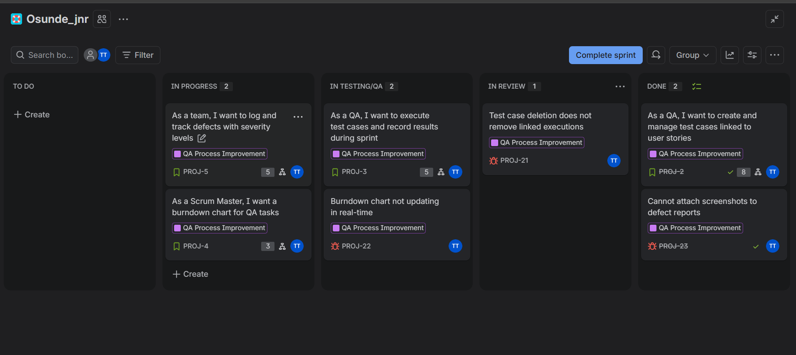
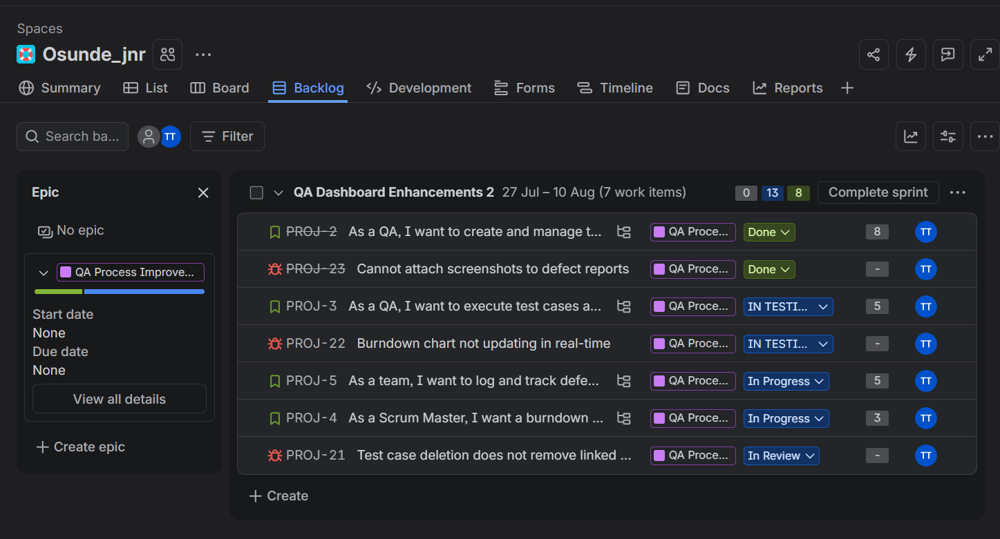
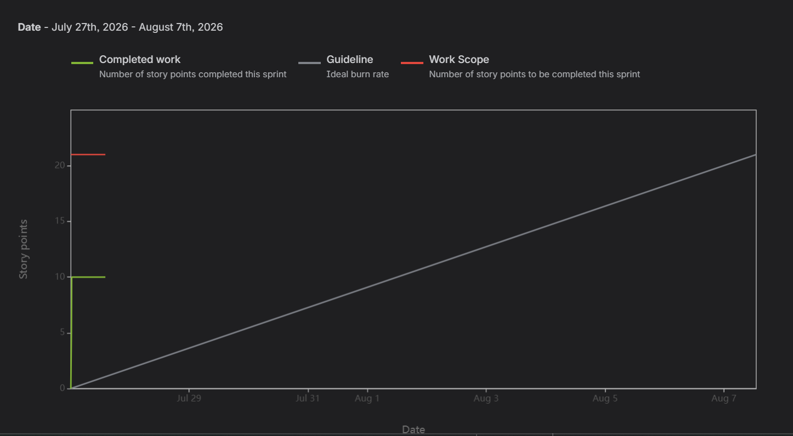
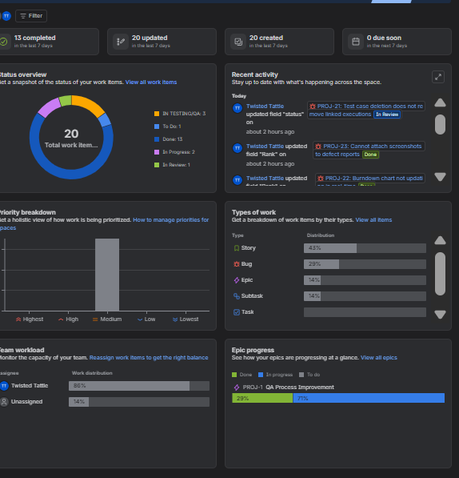
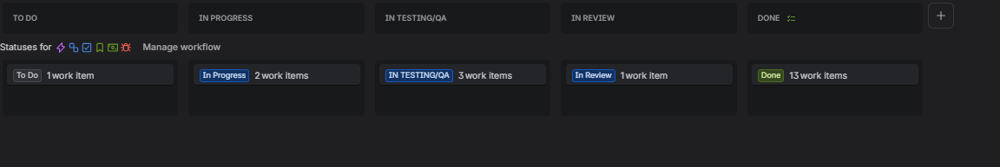
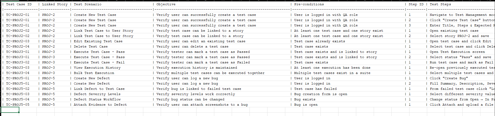

# AgileFlow QA - Jira Scrum + Kanban Sprint Demo

A complete end-to-end **Scrum and Kanban** sprint demonstration focused on QA activities. Built to showcase Agile practices and QA engineering skills.

## 🎯 Project Highlights

- **Sprint Duration**: 2 weeks (Sprint 7)
- **Methodology**: Scrumban (Scrum + Kanban hybrid)
- **Total Story Points**: 21
- **QA Focus**: Test case management, defect tracking, test execution, and reporting

## ✨ Features Demonstrated

- Full Scrum ceremonies (Sprint Planning, Daily Standup, Review, Retrospective)
- Custom Kanban workflow with QA-specific column (`In Testing / QA`)
- Epic → Stories → Sub-tasks hierarchy
- Bug tracking integrated with testing
- Burndown chart and Velocity tracking
- Test case linkage to user stories

## 📸 Screenshots

### Sprint Board

### Burndown Chart

### Sprint Backlog

### Burnup Chart

### Sprint Summary

### Board Configuration

### QA Test Case Story

## 📋 Sprint Details

- **Sprint Goal**: Improve test management and defect visibility
- **Completed Stories**: 1/4
- **Velocity**: 20 points

## 🛠 Tools Used
- Jira Software (Scrum + Kanban)
- Custom QA workflows

## 📄 Documentation
- [Sprint Planning](docs/sprint_planning.md)
- [Acceptance Criteria](docs/acceptance_criteria.md)
- [Retrospective Notes](docs/retrospective.md)